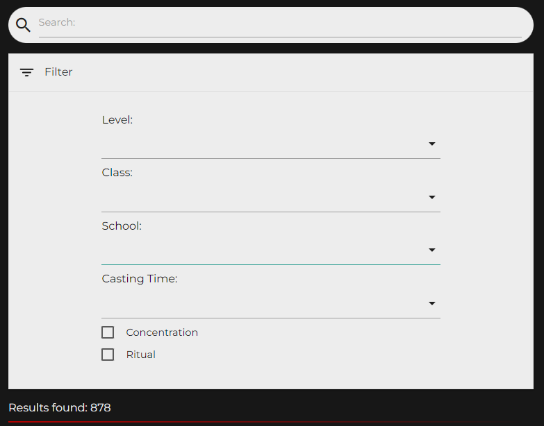
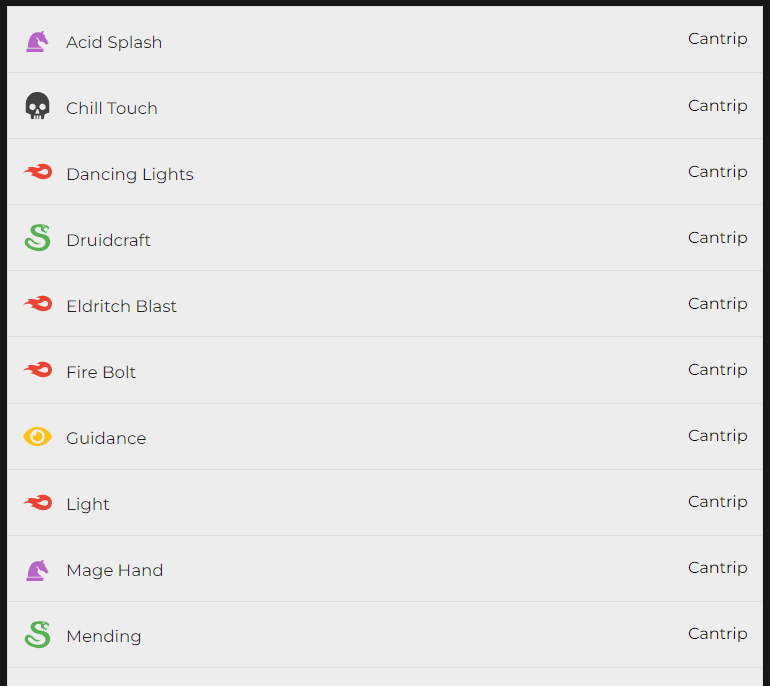
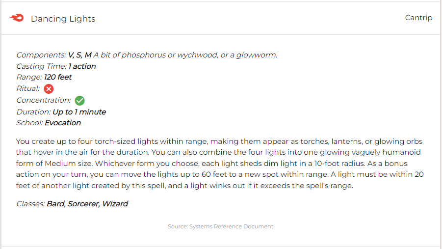

# Yggdramor

    

## **Table of contents**

- [Yggdramor](#yggdramor)
  - [**Table of contents**](#table-of-contents)
  - [**About**](#about)
  - [**Features**](#features)
    - [Spells](#spells)
  - [**Credits**](#credits)
    - [API](#api)
    - [Technologies used](#technologies-used)
    - [Media](#media)
    - [Help and Info](#help-and-info)

## **About**

This site is a TTRPG aid created for dungeons and dragons 5th edition. Looking for a 5th level ritual spell that can be used by your warlock? Need to know what wizard spells are enchantment or illusion and of 4th level and bellow for your arcane trickster rouge? Complex filtering through spells can be tricky or impossible with some of the tools out there, so I decided to make my own. Filter by spell level, caster class, spell school and casting time as well as by concentration and ritual tags.

Also includes pages for conditions and character feats.

## **Features**

### Spells

The primary feature of this site is the spell search/filter system which can be located at the top of the spells page.

- Entering a search term will return all spells which match the term in any field.
- The expandable filters section allows the user to select any number of spell levels, classes, schools and casting times as well as whether they want to return concentration and/or ritual spells. The search will return all spells that match ALL filters (this also includes any entered search term).
- The number of spells matching the current search is shows at the bottom of this section and will update live along with the displayed spells.

    

All spells are displayed in a list (30 to a page). Each item contains an icon to represent the spells school, name and level.

    

Clicking on one of these items will expand the selection displaying further spell details. These include

- Components (Conditionally renders any required casting materials if this information is available)
- Casting time
- Range
- Ritual tag
- Concentration tag
- Duration
- School
- Description (Conditionally renders effects for casting the spell at higher level if this information is available)
- Classes
- Information source

    

## **Credits**

- Dungeons and Dragons and all related trademarks are the property of [Wizards of the Coast](https://company.wizards.com/en)

### API

- [Open5e API](https://open5e.com/) - Permission to copy, modify and distribute the files collectively known as open5e.com is granted solely through the use of the Open Gaming License, Version 1.0a. See [here](https://open5e.com/legal) for more details.

### Technologies used

- React
- React Router
- React Icons
- Netlify
- Materialize

### Media

Logo and favicon where created by me using Dall E and edited using Adobe Photoshop.

### Help and Info

- [Frontend Pagination: Traversy Media](https://www.youtube.com/watch?v=IYCa1F-OWmk&ab_channel=TraversyMedia) - Youtube tutorial.
