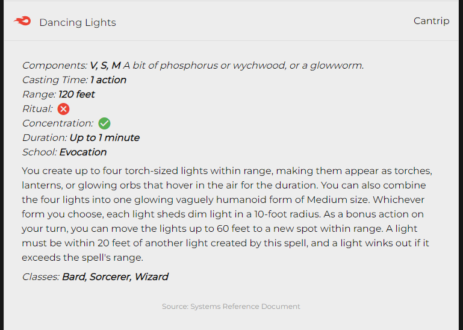

# Yggdramor

    

## **Table of contents**

- [Yggdramor](#yggdramor)
  - [**Table of contents**](#table-of-contents)
  - [**About**](#about)
  - [**Design**](#design)
  - [**Features**](#features)
    - [Navigation](#navigation)
    - [Pagination](#pagination)
    - [Spells](#spells)
    - [Other pages](#other-pages)
  - [**Credits**](#credits)
    - [API](#api)
    - [Technologies used](#technologies-used)
    - [Media](#media)
    - [Help and Info](#help-and-info)

## **About**

This site is a TTRPG aid created for Dungeons and Dragons 5th edition. This little project started off as an excuse to practice coding in React and to address some of the problems my D&D group and I have had with other spell-searching apps; Namely that they often fall short when it comes to more complex filtering. If you're just looking for all of the wizard spells then you're probably fine, but if you've ever played a spell thief rouge and needed to find all the wizard spells that are from either the enchantment or illusion schools AND between levels 1 and 4 then you probably know it's a bit of a pain. Even just figuring out if there are any good ritual spells for your class at your new level can sometimes be a challenge.

Also includes pages for conditions, character feats and Monsters.

## **Design**

This site uses a dark theme with a single bright red accent colour in keeping with D&Ds themes. The high contrast this provides aims to make navigating and reading the pages easy.

    

## **Features**

### Navigation

- The Landing/Home page consists of links to each of the information pages.

    

- Each of the information pages contains a quick nav section for traversal between pages without first returning to the Landing page.

    

    

### Pagination

Any of the information pages that displays more than 100 results (adaptive to current search) splits the results into pages which can then be traversed via a navigational element at the bottom of the page.

    

### Spells

The primary feature of this site is the spell search/filter system which can be located at the top of the spells page.

- Entering a search term will return all spells which match the term in any field.
- The expandable filters section allows the user to select any number of spell levels, classes, schools and casting times as well as whether they want to return concentration and/or ritual spells. The search will return all spells that match ALL filters (this also includes any entered search term).
- The number of spells matching the current search is shows at the bottom of this section and will update live along with the displayed spells.

    

All spells are displayed in a list (30 to a page). Each item contains an icon to represent the spells school, name and level.

    

Clicking on one of these items will expand the selection displaying further spell details. These include

- Components (Conditionally renders any required casting materials if this information is available)
- Casting time
- Range
- Ritual tag
- Concentration tag
- Duration
- School
- Description (Conditionally renders effects for casting the spell at higher level if this information is available)
- Classes
- Information source

    

### Other pages

The conditions, feats and monsters pages follow a similar format to the spells page, with search/filter functionality at the top followed by the number of matching results and finally expandible sections to display the individual items.

The About page contains a short description of the site and it's creation, credits and legal information.

## **Credits**

- Dungeons and Dragons and all related trademarks are the property of [Wizards of the Coast](https://company.wizards.com/en)

### API

- [Open5e API](https://open5e.com/) - Permission to copy, modify and distribute the files collectively known as open5e.com is granted solely through the use of the Open Gaming License, Version 1.0a. See [here](https://open5e.com/legal) for more details.

### Technologies used

- [React](https://reactjs.org/)
- [React Router](https://reactrouter.com/en/main)
- [React Icons](https://react-icons.github.io/react-icons/)
- [Netlify](https://www.netlify.com/)
- [Materialize](https://materializecss.com/)
- [Axios](https://axios-http.com/)

### Media

Logo and favicon where created by me using Dall E and edited using Adobe Photoshop.

Fonts are courtesy of [Google Fonts](https://developers.google.com/fonts).

### Help and Info

- [Frontend Pagination: Traversy Media](https://www.youtube.com/watch?v=IYCa1F-OWmk&ab_channel=TraversyMedia) - Youtube tutorial.
